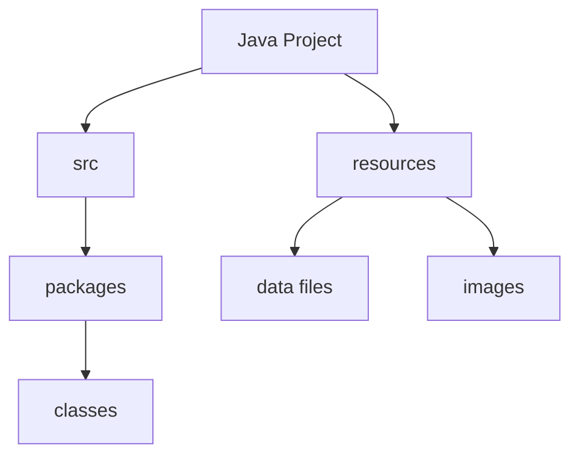
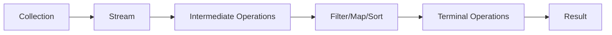
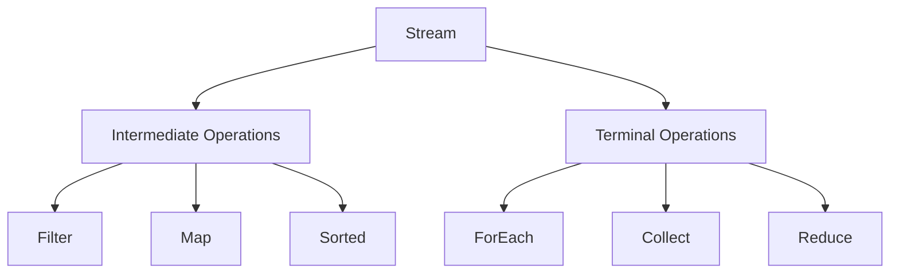
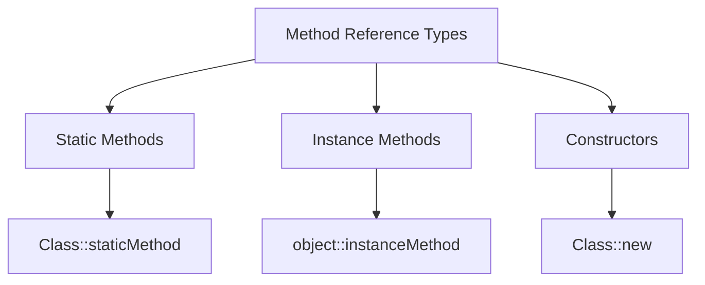
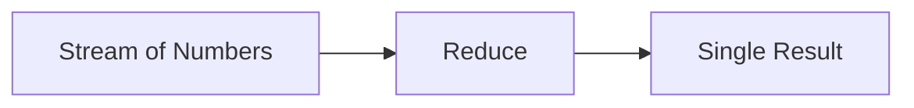
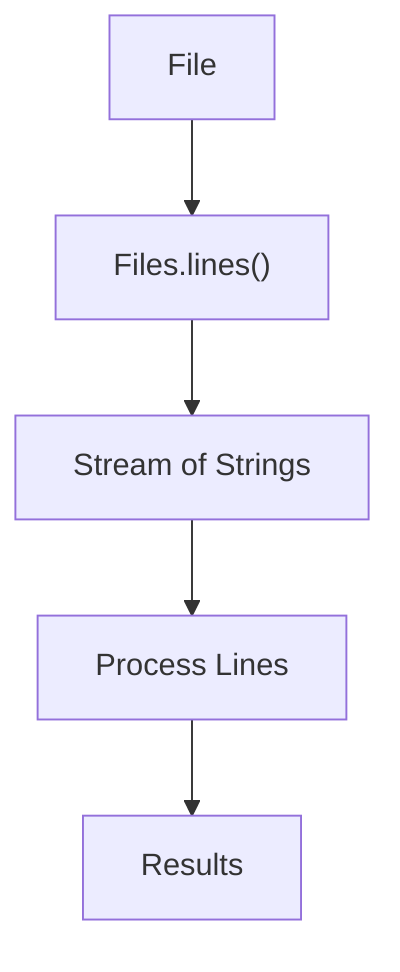

# Java Stream API Lab

## Table of Contents

[1. Project Setup](#1-project-setup)  
[2. Introduction to Java Streams](#2-introduction-to-java-streams)  
[3. Basic Stream Operations](#3-basic-stream-operations)  
[4. Method References](#4-method-references)  
[5. Advanced Stream Operations](#5-advanced-stream-operations)  
[6. Combining Streams with I/O](#6-combining-streams-with-io)  
[7. Best Practices and Common Pitfalls](#7-best-practices-and-common-pitfalls)  

## 1. Project Setup

### Concept Introduction: Java Project Structure

In Java development, organizing your code into projects and packages is crucial for maintainability and scalability. A typical Java project structure includes:

- **Project**: The top-level container for all your code and resources
- **Packages**: Directories that group related classes
- **Classes**: Individual Java files containing code



### DIY Task 1: Create Project Structure

1. Create a package named `ie.atu.streamlab`
2. In this package, create a class named `Main`
3. Add the following starter code:

```java
package ie.atu.streamlab;

public class Main {
    public static void main(String[] args) {
        System.out.println("Hello, Java Streams!");
    }
}
```
4. Create a new directory named `resources` at the root level of your project, beside the src folder, as indicated in the diagram above. We will use this folder later to store text file to be processed.   

## 2. Introduction to Java Streams

### Concept Introduction: Java Streams

Java Streams, introduced in Java 8, provide a powerful and efficient way to process collections of data. Streams allow for functional-style operations on sequences of elements.



### Key Concepts

- Streams don't store elements; they convey elements from a source
- Stream operations are divided into intermediate and terminal operations
- Streams are lazy; computation occurs only when a terminal operation is initiated

### Code Example: Simple Stream

```java
import java.util.Arrays;
import java.util.List;

public class Main {
    public static void main(String[] args) {
        List<String> names = Arrays.asList("Alice", "Bob", "Charlie", "David");

        names.stream()
             .filter(name -> name.startsWith("A"))
             .forEach(name -> System.out.println(name));
    }
}
```

### DIY Task 2: Basic Stream Operations

1. Create a list of integers from 1 to 10
2. Use a stream to filter out even numbers
3. Print the remaining numbers
4. Expected output: 1, 3, 5, 7, 9

## 3. Basic Stream Operations

### Concept Introduction: Stream Operations Types

Streams support two types of operations:

1. **Intermediate Operations**:
   - Return a new stream
   - Are lazy (not executed immediately)
   - Examples: filter(), map(), sorted()

2. **Terminal Operations**:
   - Produce a result or side-effect
   - Trigger the stream processing
   - Examples: forEach(), collect(), count()



### Code Example: Intermediate and Terminal Operations

```java
import java.util.Arrays;
import java.util.List;
import java.util.stream.Collectors;

public class Main {
    public static void main(String[] args) {
        List<String> names = Arrays.asList("Alice", "Bob", "Charlie", "David");

        List<String> filteredNames = names.stream()
                                        .filter(name -> name.length() > 3) // Intermediate
                                        .sorted() // Intermediate
                                        .collect(Collectors.toList()) // Intermediate
                                        .forEach(name -> System.out.println(name)); // Terminal
    }
}
```

### DIY Task 3: Chain Operations

1. Create a list of strings containing fruit names:
   ```java
   List<String> fruits = Arrays.asList("apple", "banana", "grape", "kiwi", "orange", "mango");
   ```
2. Filter fruits with names longer than 4 characters
3. Sort alphabetically
4. Convert to uppercase
5. Collect into a new list
6. Print the results

Expected output:
```
APPLE
BANANA
GRAPE
MANGO
ORANGE
```

## 4. Method References

### Concept Introduction: Method References

Method references provide a shorthand notation for lambda expressions that call a single method. They make the code more readable and concise.



### Code Example: Method References

```java
import java.util.Arrays;
import java.util.List;

public class Main {
    public static void main(String[] args) {
        List<String> names = Arrays.asList("Alice", "Bob", "Charlie", "David");

        // Using lambda
        names.stream()
             .map(name -> name.toUpperCase())
             .forEach(name -> System.out.println(name));

        // Using method references
        names.stream()
             .map(String::toUpperCase)
             .forEach(System.out::println);
    }
}
```

### DIY Task 4: Method References Practice

1. Create a list of integers from 1 to 5
2. Create a utility class with a static method to double numbers:
   ```java
   public class NumberUtils {
       public static int doubleNumber(int num) {
           return num * 2;
       }
   }
   ```
3. Use method reference to double each number
4. Print the results using a println Method Reference

Expected output:
```
2
4
6
8
10
```

## 5. Advanced Stream Operations

### Concept Introduction: The Reduce Operation

The reduce operation combines elements of a stream into a single result. Think of it as taking a list of values and "reducing" them to one value. Common use cases include:
- Finding the sum of numbers
- Finding the maximum or minimum value
- Concatenating strings



### Code Example: Simple Reduce Operations

```java
import java.util.Arrays;
import java.util.List;

public class Main {
    public static void main(String[] args) {
        // Example 1: Sum numbers using reduce
        List<Integer> numbers = Arrays.asList(1, 2, 3, 4, 5);
        
        // Sum using reduce
        int sum = numbers.stream()
                        .reduce(0, (a, b) -> a + b);
        System.out.println("Sum: " + sum);  // Output: Sum: 15

        // Example 2: Find maximum number
        int max = numbers.stream()
                        .reduce(Integer.MIN_VALUE, (a, b) -> Math.max(a, b));
        System.out.println("Max value: " + max);  // Output: Max value: 5

        // Example 3: Concatenate strings
        List<String> words = Arrays.asList("Hello", " ", "World", "!");
        String combined = words.stream()
                             .reduce("", (a, b) -> a + b);
        System.out.println("Combined string: " + combined);  // Output: Hello World!
    }
}
```

### Understanding Reduce

The reduce operation takes two arguments:
1. An initial value (identity)
2. A function that combines two elements

For example, in `reduce(0, (a, b) -> a + b)`:
- `0` is the initial value
- `(a, b) -> a + b` is the function that adds two numbers together

### DIY Task 5: Reduce Practice

1. Create a list of integers: `[2, 4, 6, 8, 10]`
2. Use reduce to:
   - Calculate the product of all numbers
   - Find the minimum value
3. Print both results

Expected output:
```
Product: 3840
Minimum value: 2
```

## 6. Combining Streams with I/O

### Concept Introduction: File Processing with Streams

Java Streams can be combined with file I/O operations for efficient file processing.



### Code Example: File Processing

```java
import java.io.IOException;
import java.nio.file.Files;
import java.nio.file.Paths;
import java.util.stream.Stream;

public class Main {
    public static void main(String[] args) {
        String inputPath = "resources/input.txt";

        try (Stream<String> lines = Files.lines(Paths.get(inputPath))) {
            lines.filter(line -> line.contains("Java"))
                 .map(String::trim)
                 .forEach(line -> System.out.println(line));
        } catch (IOException e) {
            System.err.println("Error reading file: " + e.getMessage());
        }
    }
}
```

### DIY Task 6: File Processing

1. Create a file named "input.txt", with at least three lines of text, and place it inside the `resources` folder
2. Read the file using Files.lines()
3. Count the number of lines containing a specific word
4. Calculate the average line length
5. Print the results

Expected output (example):
```
Lines containing "Java": 3
Average line length: 42.5
```

## 7. Best Practices and Common Pitfalls

### Best Practices

1. **Use Appropriate Operations**
   - Choose the right operation for your use case
   - Consider using specialized streams (IntStream, LongStream) for primitives

2. **Resource Management**
   - Always close streams that wrap I/O resources
   - Use try-with-resources for AutoCloseable streams

3. **Performance Considerations**
   - Use parallel streams judiciously
   - Consider collection size when deciding between sequential and parallel processing

### Common Pitfalls

1. **Infinite Streams**
   - Always limit infinite streams
   - Be careful with generate() and iterate()

2. **Stream Reuse**
   - Streams cannot be reused after terminal operation
   - Create new streams as needed

3. **Stateful Operations**
   - Avoid stateful lambda expressions in parallel streams
   - Be careful with sorted() and distinct() in parallel streams

### Example: Common Pitfalls

```java
public class StreamPitfalls {
    public static void main(String[] args) {
        // Infinite stream - BAD
        Stream.iterate(1, n -> n + 1)
              .forEach(System.out::println);

        // Infinite stream with limit - GOOD
        Stream.iterate(1, n -> n + 1)
              .limit(10)
              .forEach(n -> System.out.println(n));

        // Stream reuse - BAD
        Stream<String> stream = Arrays.asList("a", "b", "c").stream();
        stream.forEach(System.out::println);
        stream.forEach(System.out::println); // IllegalStateException

        // Stream reuse - GOOD
        List<String> list = Arrays.asList("a", "b", "c");
        list.stream().forEach(s -> System.out.println(s));
        list.stream().forEach(s -> System.out.println(s));
    }
}
```

## Try This at Home!

Here's a fun challenge to practice everything you've learned! Try creating a program that processes student records:
1. Create a CSV file with student data (name, grade, department)
2. Write a program that:
   - Reads the file using Streams
   - Filters students with grades above 70
   - Finds the average grade
   - Prints out the top performers

This will help you practice using different stream operations together. Don't worry if you don't get it perfect the first time - experiment and have fun with it!

---

Remember to check the official Java documentation for more details on Stream API methods and best practices. Happy coding!
