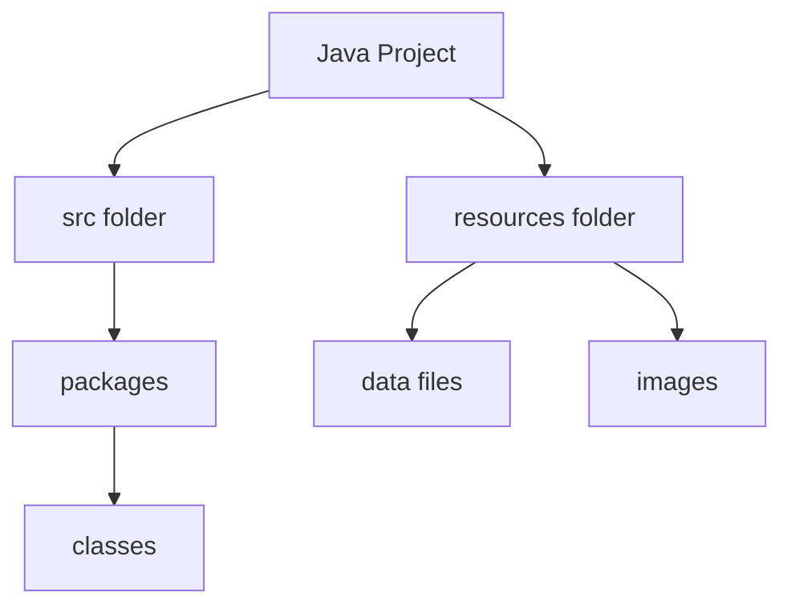
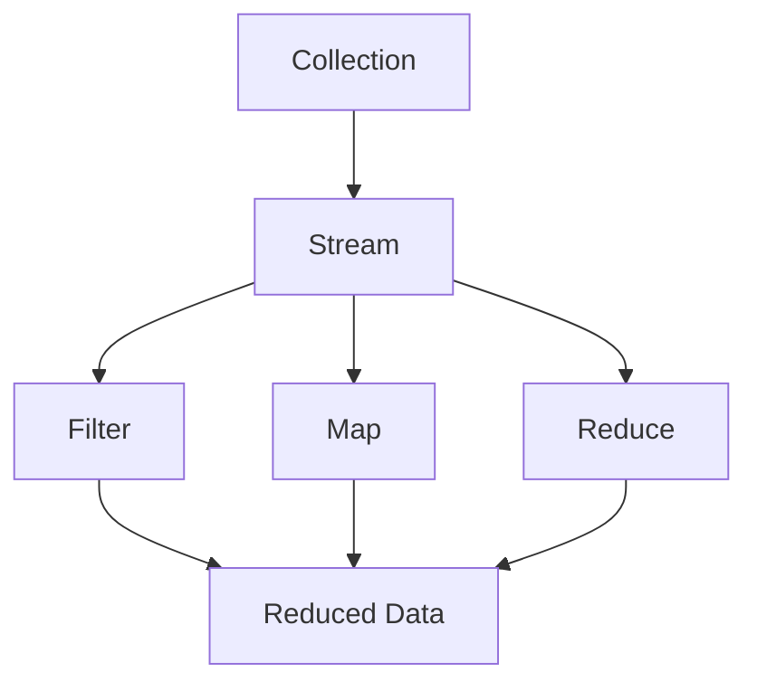
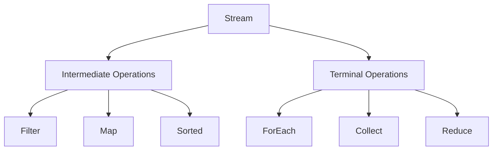
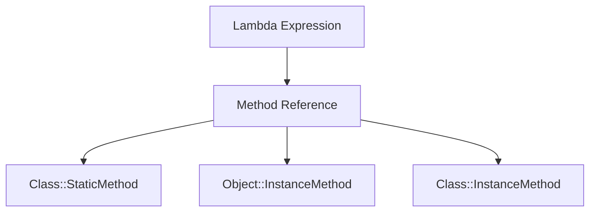
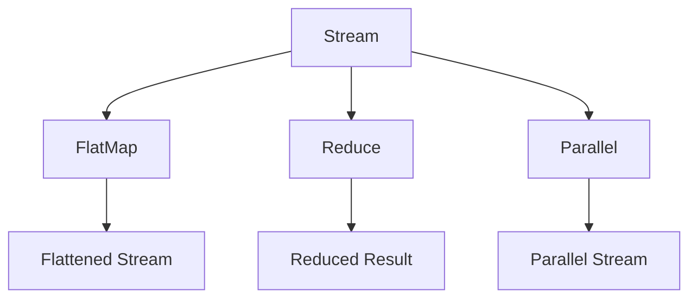
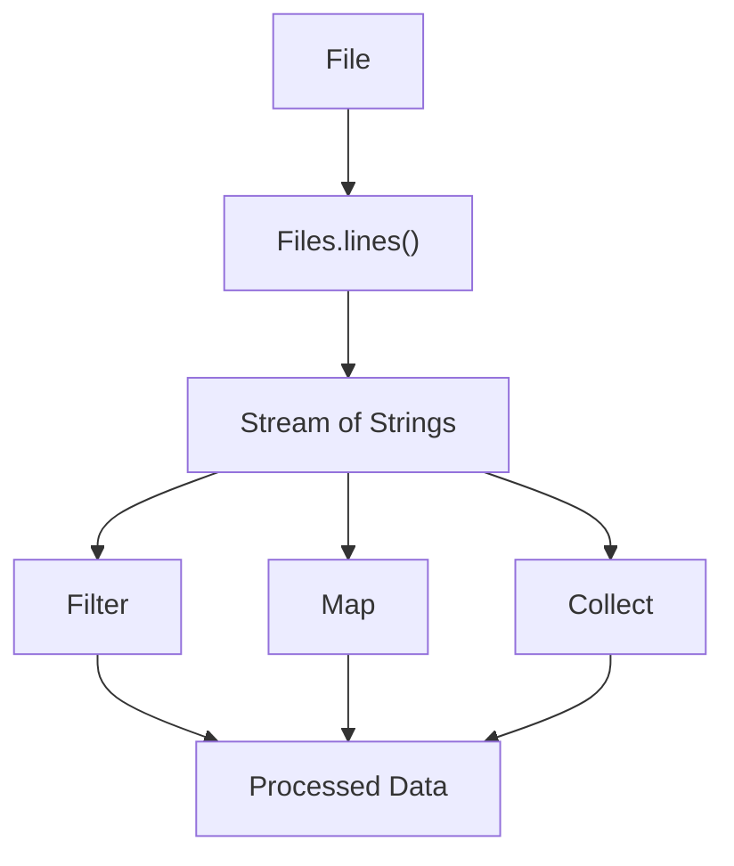

# Java Stream API Lab

## Agenda

1. [Project Setup](#1-project-setup)
2. [Introduction to Java Streams](#2-introduction-to-java-streams)
3. [Basic Stream Operations](#3-basic-stream-operations)
4. [Using Method References](#4-using-method-references)
5. [Advanced Stream Operations](#5-advanced-stream-operations)
6. [Combining Streams with I/O](#6-combining-streams-with-io)

## 1. Project Setup

### Concept Introduction: Java Project Structure

In Java development, organizing your code into projects and packages is crucial for maintainability and scalability. A typical Java project structure includes:

- **Project**: The top-level container for all your code and resources.
- **Packages**: Directories that group related classes.
- **Classes**: Individual Java files containing code.



### Explanation

Creating a well-structured project is the first step in Java development. It helps in organizing code, managing dependencies, and separating concerns. In this lab, we'll create a simple project structure.

### Code Example

```java
// File: src/com/example/streamlab/Main.java
package com.example.streamlab;

public class Main {
    public static void main(String[] args) {
        System.out.println("Hello, Java Streams!");
    }
}
```

### DIY Task

Create the project structure as follows:
1. Create a folder named `resources` in your project root (i.e., at the same level as the `src` folder (NOT inside the `src` folder)).
2. Create a package named "com.example.streamlab".
3. In this package, create a class named `Main`.
4. Add a `main` method to the `Main` class and print "Hello, Java Streams!" to the console.
5. Run the program to ensure it works correctly.

## 2. Introduction to Java Streams

### Concept Introduction: Java Streams

Java Streams, introduced in Java 8, provide a powerful and efficient way to process collections of data. Streams allow for functional-style operations on sequences of elements, such as filtering, mapping, and reducing.



### Explanation

Streams are not data structures; they don't store elements. Instead, they convey elements from a source (such as a collection) through a pipeline of computational operations. Streams are lazy; computation on the source data is only performed when the terminal operation is initiated.

### Code Example

```java
import java.util.Arrays;
import java.util.List;

public class Main {
    public static void main(String[] args) {
        List<String> names = Arrays.asList("Alice", "Bob", "Charlie", "David");

        names.stream()
             .filter(name -> name.startsWith("A"))
             .forEach(System.out::println);
    }
}
```

### DIY Task

1. Create a list of integers from 1 to 10.
2. Use a stream to filter out even numbers and print the remaining numbers.
3. Modify the stream to square each number before printing.

## 3. Basic Stream Operations

### Concept Introduction: Stream Operations

Streams support various operations that can be categorized into intermediate and terminal operations. Intermediate operations return a new stream, allowing for method chaining, while terminal operations produce a result or side-effect.



### Explanation

Intermediate operations are lazy and are not executed until a terminal operation is invoked. This allows for efficient processing and optimization.

### Code Example

```java
import java.util.Arrays;
import java.util.List;
import java.util.stream.Collectors;

public class Main {
    public static void main(String[] args) {
        List<String> names = Arrays.asList("Alice", "Bob", "Charlie", "David");

        List<String> filteredNames = names.stream()
                                          .filter(name -> name.length() > 3)
                                          .sorted()
                                          .collect(Collectors.toList());

        filteredNames.forEach(System.out::println);
    }
}
```

### DIY Task

1. Create a list of strings containing different fruit names.
2. Use a stream to filter out fruits with names shorter than 5 characters.
3. Sort the remaining fruits alphabetically and collect them into a new list.
4. Print the sorted list.

## 4. Using Method References

### Concept Introduction: Method References

Method references provide a way to refer to methods without invoking them. They are a shorthand notation of a lambda expression to call a method.



### Explanation

Method references can be used to refer to static methods, instance methods, or constructors. They make the code more readable and concise.

### Code Example

```java
import java.util.Arrays;
import java.util.List;

public class Main {
    public static void main(String[] args) {
        List<String> names = Arrays.asList("Alice", "Bob", "Charlie", "David");

        names.stream()
             .map(String::toUpperCase)
             .forEach(System.out::println);
    }
}
```

### DIY Task

1. Create a list of integers from 1 to 5.
2. Use a stream to double each number using a method reference.
3. Print the doubled numbers.

## 5. Advanced Stream Operations

### Concept Introduction: Advanced Stream Operations

Streams support advanced operations like flatMap, reduce, and parallel processing, which allow for more complex data transformations and computations.



### Explanation

Advanced operations enable powerful data processing capabilities. For example, flatMap can be used to flatten nested structures, and reduce can be used to aggregate data.

### Code Example

```java
import java.util.Arrays;
import java.util.List;

public class Main {
    public static void main(String[] args) {
        List<List<String>> nestedList = Arrays.asList(
            Arrays.asList("Alice", "Bob"),
            Arrays.asList("Charlie", "David")
        );

        nestedList.stream()
                  .flatMap(List::stream)
                  .forEach(System.out::println);
    }
}
```

### DIY Task

1. Create a list of lists of integers.
2. Use flatMap to flatten the list of lists into a single list.
3. Use reduce to sum all the integers in the flattened list.
4. Print the sum.

## 6. Combining Streams with I/O

### Concept Introduction: Streams and File I/O

Java Streams can be combined with file I/O operations to process file contents efficiently. The `Files.lines()` method provides a convenient way to read a file line by line as a stream.



### Explanation

Using streams with file I/O allows for efficient and declarative processing of file contents. Streams can be used to filter, map, and collect data from files.

### Code Example

```java
import java.io.IOException;
import java.nio.file.Files;
import java.nio.file.Paths;
import java.util.stream.Stream;

public class Main {
    public static void main(String[] args) {
        String inputPath = "resources/input.txt";

        try (Stream<String> lines = Files.lines(Paths.get(inputPath))) {
            lines.filter(line -> line.contains("Java"))
                 .forEach(System.out::println);
        } catch (IOException e) {
            System.err.println("Error reading file: " + e.getMessage());
        }
    }
}
```

### DIY Task

1. Create a text file named "input.txt" in the resources folder with some sample text.
2. Use `Files.lines()` to read the file as a stream.
3. Filter the lines that contain the word "Java".
4. Print the filtered lines.

---
End of Lab